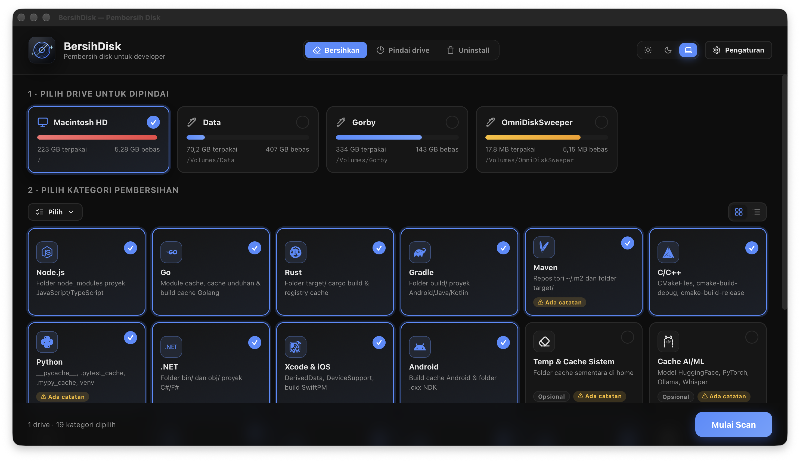
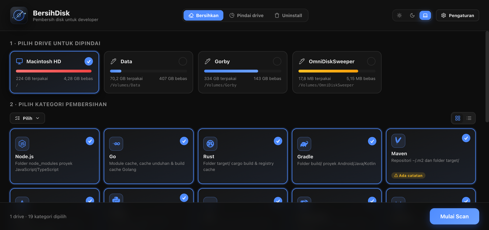
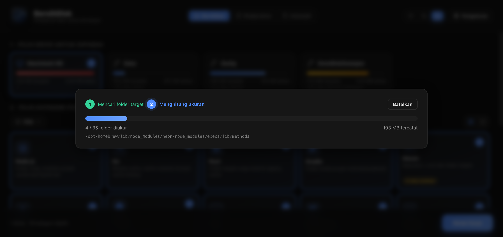
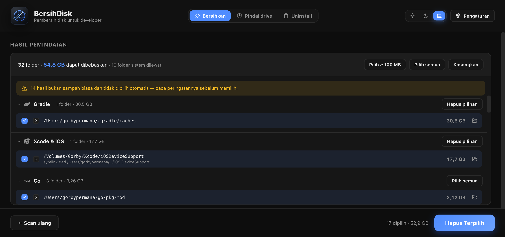
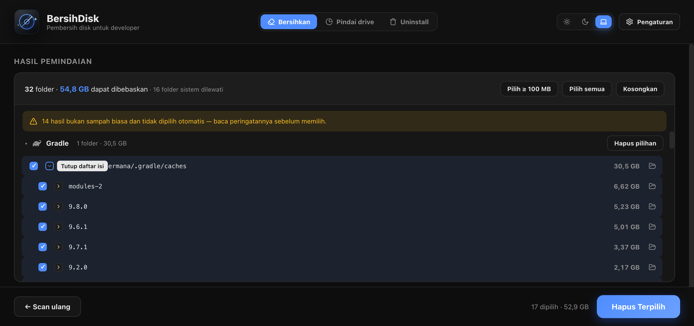
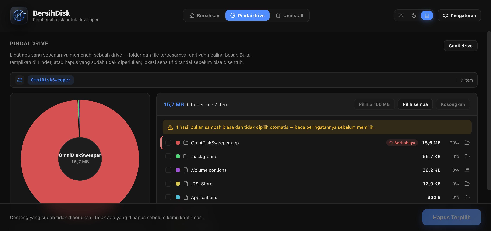
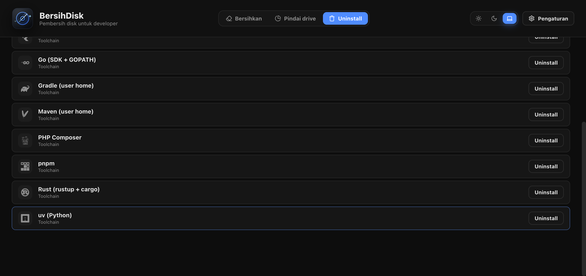
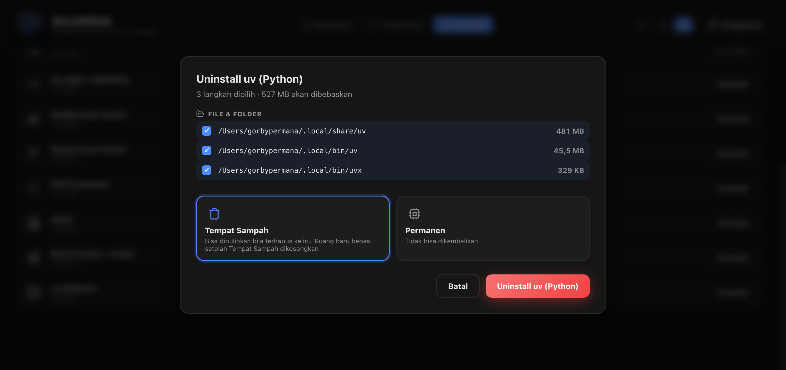
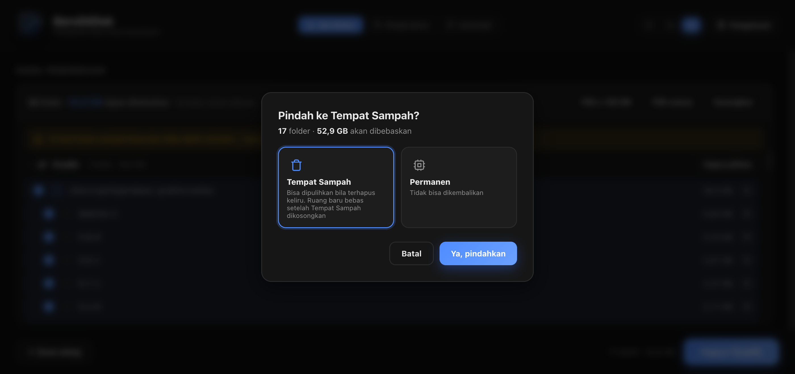
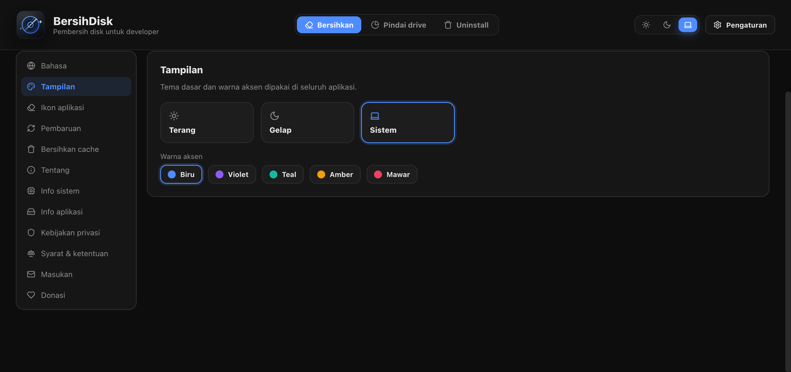

<div align="center">


# BersihDisk

**Pembersih disk untuk developer** · **Disk cleaner for developers**

Membersihkan gigabyte yang ditinggalkan toolchain-mu: `node_modules`, build artifact, cache paket, cache model AI, dan file temp — dengan UI bilingual modern dan langkah hapus yang kamu kendalikan.

[](https://github.com/cybersafetyid/BersihDisk/releases)
[](https://github.com/cybersafetyid/BersihDisk/releases)
[](https://github.com/cybersafetyid/BersihDisk/commits/main)
[](https://github.com/cybersafetyid/BersihDisk/issues)
[](https://github.com/cybersafetyid/BersihDisk)
[](https://github.com/cybersafetyid/BersihDisk/forks)

[](#-mulai-menggunakan)
[](https://go.dev)
[](https://wails.io)
[](https://react.dev)
[](https://www.typescriptlang.org)
[](https://vitejs.dev)

[](LICENSE)
[](#-pengujian)
[](#-kategori-pembersihan)
[](#-privasi)
[](#-bahasa)
[](CONTRIBUTING.md)
[](CODE_OF_CONDUCT.md)
[](CHANGELOG.md)

**[English](README.md)** · **Bahasa Indonesia**

[Unduh](https://github.com/cybersafetyid/BersihDisk/releases) · [Cuplikan Layar](#-cuplikan-layar) · [Fitur](#-fitur) · [Mulai](#-mulai-menggunakan) · [Kategori](#-kategori-pembersihan) · [Kontribusi](CONTRIBUTING.md) · [Changelog](#-changelog--rilis) · [Donasi](#-sponsor-donasi)

<br />

<p align="center">
  
</p>

> Dokumentasi ini tersedia dalam dua bahasa: **[English](README.md)** dan **Bahasa Indonesia** (berkas ini).
</div>

---

## 📸 Cuplikan Layar

Lihat bagaimana BersihDisk menjaga ruang penyimpanan perangkat developer tetap lega, bersih, dan optimal:

### 1. Pemindai Toolchain & Kategori Developer
Pilih drive yang terpasang dan pindai 24 kategori sampah developer (`node_modules`, Go module cache, Cargo build cache, Gradle, Xcode DerivedData, Docker buildx, model AI/ML, dan banyak lagi).

<p align="center">
  
</p>

### 2. Engine Scan Dua Fase Berperforma Tinggi
Lihat scanner berjalan secara live memeriksa jutaan folder secara concurrent dan aman, dilengkapi proteksi folder sistem (skip-list) dan penghitung kandidat waktu-nyata.

<p align="center">
  
</p>

### 3. Hasil Scan Terperinci & Klasifikasi Risiko
Bebaskan puluhan gigabyte dengan rasa aman. Setiap hasil dinilai tingkat risikonya (*Aman*, *Hati-hati*, *Berbahaya*, *Terlindungi*) sehingga berkas penting atau aset kerja tidak akan terhapus keliru. Telusuri subfolder secara mendalam dengan penghitungan ukuran paralel.

| Hasil Scan & Tingkat Risiko | Penelusuran Isi Folder (Drilldown) |
|:---:|:---:|
|  |  |

### 4. Peta Penggunaan Drive Interaktif Bergaya DaisyDisk
Gunakan tab **Pindai drive** untuk melihat diagram matahari (sunburst) interaktif dari folder-folder yang memenuhi drive. Arahkan mouse, lakukan drilldown, dan tinjau status keamanannya sebelum mengambil tindakan.

<p align="center">
  
</p>

### 5. Uninstaller Tool Developer & Aplikasi Bersih Tuntas
Pencopotan menyeluruh untuk aplikasi, runtime & SDK (uv, Rust, Go, Bun, Deno, pnpm), dan paket. Tinjau setiap langkah rencana uninstall (binary, cache, konfigurasi, dan jalur shell profile) sebelum dieksekusi.

| Daftar Aplikasi & Toolchain | Tinjauan Rencana Uninstall Langkah demi Langkah |
|:---:|:---:|
|  |  |

### 6. Mode Penghapusan Aman & Kustomisasi Tampilan
Pilih penghapusan ke **Tempat Sampah** (bawaan, aman & bisa dipulihkan) atau **Permanen** (dengan modal konfirmasi ganda). Personalisasi pengalamanmu dengan tema Gelap/Terang/Sistem, beragam warna aksen, dan penggantian ikon dock.

| Konfirmasi Hapus Aman | Pengaturan & Kustomisasi Tema |
|:---:|:---:|
|  |  |

---

## Tentang

BersihDisk adalah pembersih disk **dan uninstaller** desktop untuk developer. Satu mesin yang dipakai
membangun perangkat lunak menumpuk cache dengan cepat — `node_modules` di tiap
proyek, modul cache Go dan Cargo, repositori Gradle dan Maven, layer buildx
Docker, bobot model HuggingFace, DerivedData Xcode — dan sebagian besarnya bisa
dibangun ulang. BersihDisk mencari direktori itu di semua drive yang terpasang,
menampilkan isinya, lalu hanya menghapus apa yang kamu centang. Setiap hasil diberi
tingkat risiko, sehingga folder yang hanya *terlihat* seperti sampah — `node_modules`
global, bundle aplikasi, gem Ruby yang kamu pasang sendiri — ditandai (atau ditolak)
sebelum sempat merusak sesuatu. Bagian kedua aplikasi mencopot tool utuh — Node,
Rust, Python, Docker, VS Code, dan kawan-kawan — beserta cache, konfigurasi, baris
profil shell, entri PATH, dan kunci registry yang ditinggalkannya.

Aplikasi desktop native (Go + Wails) dengan antarmuka web (React + TypeScript):
scan cepat dan concurrent, UI tetap responsif. Tanpa akun, tanpa server, tanpa
unggah data.

## ✨ Fitur

**Deteksi**
- **Scan multi-drive** — macOS (`/Volumes`), Windows (A:–Z: via WinAPI), Linux (`/proc/mounts`), lengkap dengan kapasitas terpakai/bebas
- **Engine dua fase** — fase *cari* (walking directory tree dengan skip-list proteksi folder sistem) lalu fase *ukur* (menghitung ukuran secara concurrent), dengan progress live dan batal
- **Filter konten cerdas** — folder `build`/`target`/`bin`/`obj` generik hanya dihitung artefak jika isinya bukan kode sumber
- **Telusuri isi folder** — hasil scan bisa dibuka isinya (lazy, ukuran tiap anak dihitung paralel) sehingga file/folder di dalamnya dipilih satu per satu; anak dari folder yang ikut terpilih tidak dihitung ganda
- **Peta pemakaian drive** — mode *Pindai drive* mengukur seluruh isi drive dari yang terbesar dan menampilkannya sebagai diagram matahari gaya DaisyDisk yang bisa di-hover dan ditelusuri; tiap entri tetap membawa tingkat risikonya, jadi folder sistem, home, atau kredensial ditandai — atau dikunci — sebelum bisa dipilih

**Keamanan** — lihat [Keamanan](#-keamanan)
- **Tingkat risiko** — tiap hasil *aman*, *hati-hati*, *berbahaya*, atau *dilindungi*, lengkap dengan alasannya; hasil berisiko tidak pernah tercentang otomatis dan butuh centang "Saya mengerti"
- **Penjaga keras** — folder home, folder data pribadi, kredensial (`~/.ssh`, `~/.aws`, …), dan pohon sistem operasi tidak bisa dihapus, dan dicek ulang di dalam deleter
- **Pemeriksaan konteks** — `node_modules` di dalam bundle aplikasi, ekstensi editor, `nvm`/`pyenv`, atau folder `lib/` global berstatus berbahaya; yang tanpa `package.json` di sebelahnya berstatus hati-hati

**Uninstall** — lihat [Uninstaller](#-uninstaller)
- **Aplikasi, runtime, dan paket** — aplikasi macOS, *Installed apps* Windows, launcher & Flatpak Linux; toolchain Node/Python/Rust/Go/Ruby/Java; paket npm, pip, pipx, cargo, Homebrew, RubyGems, Scoop, dan `go install`
- **Bersih, bukan sekadar dicopot** — perintah uninstall bawaan tool dulu, lalu cache, konfigurasi, baris profil shell, entri PATH Windows, dan kunci registry — setiap langkah bisa ditinjau dan dicentang satu per satu

**Pembersihan**
- **24 kategori** dengan ikon merek resmi — lihat [Kategori pembersihan](#-kategori-pembersihan)
- **Bulk delete** — multi-select, pintasan "Pilih semua" / "Pilih ≥ 100 MB", konfirmasi sebelum eksekusi
- **Dua mode hapus** — **Tempat Sampah** (default, bisa dipulihkan, lintas-platform via [go-trash](https://github.com/laurent22/go-trash)) atau **Permanen** (`os.RemoveAll`, dikunci modal merah dengan konfirmasi ganda)
- **Buka di Finder / Explorer** — di tiap baris hasil dan tiap anak folder

**Antarmuka**
- **UI bilingual** — Inggris dan Bahasa Indonesia, diganti saat aplikasi berjalan dan tersimpan
- **Tema Gelap / Terang / Sistem** pada hitam doff netral, plus warna aksen kustom dan pemilih ikon aplikasi saat berjalan
- Animasi di seluruh aplikasi (stagger fade-in, pop, shimmer, indeterminate progress), skeleton loading, toast, modal konfirmasi

**Pemeliharaan**
- **Pembaruan dalam aplikasi** — memeriksa GitHub Releases, menampilkan catatan rilis, mengunduh dengan progress + kecepatan, memverifikasi SHA-256 bila tersedia, lalu tombol Install yang menyerahkan berkas ke OS (`.dmg`/`.pkg`/`.zip`, `.exe`/`.msi`)
- **Panel Pengaturan** — bahasa, tema, warna aksen, ikon, pembaruan otomatis, bersihkan cache, email masukan, kebijakan privasi, dan syarat & ketentuan
- **Info sistem & aplikasi** — OS, arsitektur, core CPU, memori, ukuran aplikasi, dan folder data

## 🧹 Kategori pembersihan

24 aturan tersedia. **Default** = sudah tercentang saat kategori dipilih;
**opt-in** = tidak tercentang sampai kamu memintanya, karena menghapusnya berarti
perlu unduh ulang atau datanya hilang permanen. **Risiko** adalah tingkat terburuk
yang bisa dicapai lokasi mana pun di kategori itu (lihat [Keamanan](#-keamanan));
sel kosong berarti semua lokasinya aman.

| # | Kategori | Target | Status | Risiko |
|---|---|---|---|---|
| 1 | Node.js | `node_modules` | Default |  |
| 2 | Go | `~/go/pkg/mod`, cache unduhan, build cache | Default |  |
| 3 | Rust | `target/` (filter konten), `~/.cargo/registry` | Default |  |
| 4 | Gradle | artefak `build/` (filter) + `~/.gradle/caches` | Default |  |
| 5 | Maven | `~/.m2/repository`, `target/` (filter) | Default | hati-hati — `~/.m2/repository` bisa berisi artefak hasil install lokal |
| 6 | C / C++ | `CMakeFiles`, `cmake-build-*` | Default |  |
| 7 | Python | `__pycache__`, `.pytest_cache`, `.mypy_cache`, `.ruff_cache`, venv | Default | hati-hati — virtualenv |
| 8 | .NET | `bin/`, `obj/` (filter Debug/Release/.dll) | Default |  |
| 9 | Build cache frontend | `.next`, `.nuxt`, `.turbo`, `.vite`, `.parcel-cache`, `.svelte-kit`, `.astro`, `coverage`, `storybook-static` | Default |  |
| 10 | Xcode & iOS | DerivedData, iOS DeviceSupport, CoreSimulator, `.build` SwiftPM | Default |  |
| 11 | Android | `app/build` (pola multi-segmen), `.cxx`, build-cache | Default |  |
| 12 | Docker & Buildx | `~/.docker/buildx`, cache & log Docker Desktop (tidak pernah disk image WSL Windows) | Default | hati-hati — definisi builder buildx |
| 13 | Homebrew | `Library/Caches/Homebrew`, `~/.cache/homebrew` | Default |  |
| 14 | PHP & Composer | `~/.composer/cache`, `~/.cache/composer` | Default |  |
| 15 | Cache paket Python | wheel cache pip / uv / Poetry, `~/.conda/pkgs` | Default |  |
| 16 | Flutter & Pub | `~/.pub-cache/hosted`, engine cache, `.dart_tool` | Default | hati-hati — tool yang diaktifkan global |
| 17 | Terraform | `.terraform/`, plugin cache | Default |  |
| 18 | .NET NuGet | `~/.nuget/packages`, HTTP cache | Default |  |
| 19 | JetBrains | cache indeks IDE (tidak pernah folder Toolbox tempat IDE terpasang) | Default |  |
| 20 | Electron & cache browser | electron, npm `_cacache`/`_npx`, yarn, pnpm, Playwright, Cypress | **opt-in** | hati-hati |
| 21 | Temp & cache sistem | `~/.cache`, `%TEMP%`, CrashDumps | **opt-in** | hati-hati — dikosongkan, foldernya tidak dihapus |
| 22 | Cache AI/ML | HuggingFace, PyTorch, Ollama, Whisper | **opt-in** | hati-hati — unduhan sangat besar |
| 23 | Ruby & Gems | `~/.gem`, cache bundler | **opt-in** | **berbahaya** — `~/.gem` berisi gem terpasang |
| 24 | Emulator & simulator | AVD Android, data iOS Simulator | **opt-in** | **berbahaya** — AVD dan simulator menyimpan data aplikasi |

## 🗑 Uninstaller

Pindah ke **Uninstall** di header. BersihDisk mendaftar apa yang terpasang, dan
memilih satu entri membuka **rencananya** — tidak ada yang dijalankan dari daftar itu.

| Kelompok | Ditemukan lewat | Dicopot dengan |
|---|---|---|
| Aplikasi | macOS `/Applications` + `~/Applications` (bundle ID dari `Info.plist`); registry *Installed apps* Windows; launcher `~/.local/share/applications` di Linux; Flatpak; Homebrew cask | macOS: bundle + berkas `~/Library`-nya; Windows: uninstaller bawaan vendor; cask: `brew uninstall --cask --zap`; Flatpak: `--delete-data` |
| Runtime & SDK | katalog data: rustup, nvm, fnm, Volta, pyenv, conda, SDKMAN!, Bun, Deno, pnpm, Poetry, uv, Go, Gradle, Maven, Flutter/Dart, Composer, .NET, rbenv, RVM | perintah bawaan tool bila ada (`rustup self uninstall`, `conda init --reverse`, `rvm implode`), lalu foldernya |
| Paket | `npm ls -g`, `pip list`, `pipx list`, `cargo install --list`, `brew leaves`, `gem list`, `scoop export`, `~/go/bin`; aplikasi Microsoft Store (`Get-AppxPackage`); Linux `apt-mark showmanual` + `dpkg-query`, `snap list`, `pacman -Qe`, `dnf repoquery --userinstalled` | `npm uninstall -g`, `pip uninstall`, `cargo uninstall`, `brew uninstall`, `Remove-AppxPackage`, … Paket sistem Linux: `apt purge`, `snap remove --purge`, `pacman -Rns`, `dnf remove` ditampilkan untuk kamu jalankan dengan `sudo` |

**Arti "bersih".** Satu rencana bisa berisi lima jenis langkah, semuanya tampil
sebelum kamu konfirmasi:

1. **Perintah** — uninstall bawaan. Bila gagal, proses berhenti: sisa dari tool yang
   menolak dicopot tidak pernah dihapus.
2. **File & folder** — cache, data, konfigurasi; default dipindah ke Tempat Sampah.
   Lokasi yang ditemukan lewat pengenal pasti (bundle ID, folder milik tool)
   tercentang dari awal; tebakan berbasis nama, file konfigurasi yang mungkin berisi
   token, dan apa pun yang mungkin hasil kerjamu (`~/go/src`, Xcode Archives, volume
   Docker) **tidak dicentang** dan diberi peringatan.
3. **Konfigurasi shell** — baris persis yang ditambahkan installer ke `~/.zshrc`,
   `~/.bashrc`, `~/.profile`, konfigurasi fish, dan sejenisnya (`. "$HOME/.cargo/env"`,
   `export NVM_DIR=…`, blok `# >>> conda initialize >>>`). Berkas dicadangkan di
   sebelahnya sebagai `*.bersihdisk-<waktu>.bak` sebelum ditulis ulang.
4. **Registry Windows** — kunci uninstall yang tertinggal; kunci diekspor ke berkas
   `.reg` di `%AppData%\BersihDisk\backups` sebelum dihapus. Hanya `HKCU` yang
   diubah otomatis.
5. **PATH** — entri PATH pengguna Windows yang menunjuk ke tool yang dicopot.

**Hak administrator.** BersihDisk tidak pernah menaikkan hak sendiri. Langkah yang
membutuhkannya (`/usr/local/go`, `/usr/local/share/dotnet`, kunci registry seluruh
mesin) ditampilkan bersama perintah persis untuk disalin dan dijalankan sendiri,
dan dilaporkan sebagai *manual*.

**Rincian platform** — setiap pilihan berasal dari dokumentasi resmi vendor/tool
(lihat [Dasar riset](#dasar-riset)):

| | macOS | Windows | Linux |
|---|---|---|---|
| Daftar aplikasi | bundle `.app`, bundle ID lewat `plutil` | Kunci registry Uninstall di **tiga** tempat: `HKLM`, `HKLM\WOW6432Node`, dan `HKCU` (instalasi per-pengguna seperti Chrome, Teams, Zoom) — bukan `Win32_Product` yang memicu konfigurasi ulang MSI | launcher `$XDG_DATA_HOME/applications`, Flatpak, Snap |
| Uninstall | bundle dipindah; binary `uninstall` bawaan Docker ditampilkan (meminta password) | `QuietUninstallString` bila ada, jika tidak `UninstallString`; MSI `/I{GUID}` diubah jadi `/X{GUID}`; dijalankan lewat `start /wait` agar UAC muncul normal | `flatpak uninstall --delete-data`; `apt purge` (bukan `remove` yang menyisakan config), `snap remove --purge` |
| Sisa | lokasi `~/Library` dari bundle ID bersifat pasti; tebakan nama tidak dicentang; **Group Containers hanya dihapus bila ID grupnya milik aplikasi itu**, karena macOS membaginya antar aplikasi | `%APPDATA%`, `%LOCALAPPDATA%`, `%PROGRAMDATA%` sesuai dokumentasi vendor (VS Code, Docker, Android Studio); kunci registry dicadangkan ke `.reg` dulu | `$XDG_CONFIG_HOME`, `$XDG_DATA_HOME`, `$XDG_CACHE_HOME`, `$XDG_STATE_HOME` — dihormati bila dipindah pengguna, default spesifikasi XDG bila tidak |
| PATH | baris profil shell, dicadangkan | PATH pengguna ditulis **langsung di registry**, tipe `REG_EXPAND_SZ` dipertahankan, lalu `WM_SETTINGCHANGE` disiarkan — bukan `setx` yang memotong di 1024 karakter | baris profil shell (`.profile`, `.bashrc`, fish), dicadangkan |
| Jebakan | menghapus `~/Library/Containers/*` gagal dengan *Operation not permitted* bahkan dengan `sudo` sampai aplikasi punya **Full Disk Access** — BersihDisk mendeteksi dan memberi tahu | aplikasi Store/MSIX tidak ada di registry Uninstall sama sekali | daftar "user installed" `dnf` bisa berisi semuanya setelah `system-upgrade`; periksa dulu |

**Cakupan platform.** macOS diuji menyeluruh. Kode registry Windows dan launcher
Linux ditulis mengikuti tata letak terdokumentasi tiap platform serta dicakup unit
test dan kompilasi lintas-platform di CI, tetapi belum sebanyak dipakai di mesin
sungguhan — tinjau rencana sebelum konfirmasi, seperti biasa. Paket sistem yang
dikelola `apt`/`dnf`/`snap` butuh root dan diserahkan ke tool tersebut.

## 📚 Dasar riset

Lokasi uninstall dan cache diperiksa terhadap dokumentasi vendor dan praktik
komunitas, bukan ditebak. Koreksi hasil riset: home Cargo di Windows adalah
`%USERPROFILE%\.cargo` (bukan `%LocalAppData%`), cache npm Windows
`%LocalAppData%\npm-cache`, cache Go `%LocalAppData%\go-build`, Yarn di macOS
`~/Library/Caches/Yarn`, cache `pip` masuk kategori pip, dan clean uninstall VS Code
juga menghapus `~/.vscode-shared`.

- [Docker Desktop — uninstall](https://docs.docker.com/desktop/uninstall/) (daftar berkas per OS, catatan Full Disk Access macOS)
- [VS Code — uninstall / clean uninstall](https://code.visualstudio.com/docs/setup/uninstall)
- [conda — uninstall](https://docs.conda.io/projects/conda/en/latest/user-guide/install/macos.html#uninstalling-anaconda-or-miniconda)
- [nvm — manual uninstall](https://github.com/nvm-sh/nvm#manual-uninstall), [rustup](https://rust-lang.github.io/rustup/installation/index.html), [Cargo home](https://doc.rust-lang.org/cargo/guide/cargo-home.html)
- [Homebrew Cask Cookbook — `zap`](https://docs.brew.sh/Cask-Cookbook#stanza-zap)
- [XDG Base Directory Specification](https://specifications.freedesktop.org/basedir/latest/)
- [Windows Installer — kunci registry Uninstall](https://learn.microsoft.com/en-us/windows/win32/msi/uninstall-registry-key), [winget `uninstall`](https://learn.microsoft.com/en-us/windows/package-manager/winget/uninstall), [`Remove-AppxPackage`](https://learn.microsoft.com/en-us/powershell/module/appx/remove-appxpackage)
- [Cache npm](https://docs.npmjs.com/cli/v8/commands/npm-cache/), [cache Yarn](https://classic.yarnpkg.com/lang/en/docs/cli/cache/)
- Komunitas: Stack Overflow soal `UninstallString`/`QuietUninstallString` dan hive `HKCU`, laporan pemotongan `setx`, `pkgutil --forget`, dan tulisan soal kepemilikan Group Containers.

**Sengaja tidak dilakukan:** menaikkan hak akses. `osascript … with administrator
privileges`, `pkexec`, dan UAC berskrip adalah pola yang ditandai alat keamanan,
dan perintah salah sebagai root tidak bisa dibatalkan — jadi langkah khusus root
ditampilkan untuk kamu jalankan sendiri.

## 🚀 Mulai menggunakan

**Unduh** build terbaru dari
[Releases](https://github.com/cybersafetyid/BersihDisk/releases):

| OS | Berkas | Pasang |
|---|---|---|
| macOS (Apple Silicon + Intel) | `BersihDisk-vX.Y.Z-macos-universal.dmg` | buka `.dmg`, seret BersihDisk ke *Applications* |
| Windows 10/11 (x64) | `BersihDisk-vX.Y.Z-windows-x86_64-setup.exe` | jalankan installer (meminta hak admin) |
| Windows, tanpa install | `BersihDisk-vX.Y.Z-windows-x86_64-portable.zip` | ekstrak lalu jalankan `BersihDisk.exe` |
| Linux (Debian/Ubuntu, x64) | `BersihDisk-vX.Y.Z-linux-x86_64.deb` | `sudo apt install ./BersihDisk-*.deb` |
| Linux, distro lain | `BersihDisk-vX.Y.Z-linux-x86_64.tar.gz` | ekstrak lalu jalankan `./BersihDisk` |

`BersihDisk-vX.Y.Z-SHA256SUMS.txt` memuat checksum tiap berkas.

Build **belum ditandatangani/dinotarisasi**. Di macOS berkas hasil unduhan browser
diberi karantina: klik kanan aplikasi → *Buka* untuk pertama kali (berkas dari
pembaruan dalam aplikasi tidak dikarantina). Di Windows, SmartScreen bisa
menampilkan "publisher tidak dikenal": *More info* → *Run anyway*. Linux butuh
GTK 3 dan WebKit2GTK 4.1 (`libgtk-3-0 libwebkit2gtk-4.1-0`, otomatis lewat `.deb`).

**Build dari sumber** (butuh Go 1.23+, Node.js 18+, Wails CLI v2.12+):

```bash
git clone https://github.com/cybersafetyid/BersihDisk.git
cd BersihDisk
make doctor          # cek toolchain
make install-deps    # npm install
make dev             # mode pengembangan hot-reload
make build           # build cepat OS saat ini -> build/bin/
make package         # build + paket OS saat ini -> dist/ (dmg / setup.exe + zip / deb + tar.gz)
make verify          # gerbang CI: gofmt, vet, tes Go, typecheck frontend
```

`make package` menjalankan `scripts/package.sh`, yang membangun dan mengemas **OS
tempat ia dijalankan** (Wails tidak bisa cross-compile aplikasi cgo). Prasyarat
tambahan: macOS — Xcode command line tools; Windows — MinGW-w64 gcc, NSIS
(`choco install nsis`), Git Bash, `make`; Linux —
`sudo apt install libgtk-3-dev libwebkit2gtk-4.1-dev dpkg-dev`. Di Windows tanpa
`make`, jalankan `bash scripts/package.sh` dari Git Bash (skrip yang sama).

> **Catatan Go ≥ 1.24**: CLI `wails` resmi gagal mem-parsing export data Go baru.
> Jalankan `make install-wails-fix` sekali; hasilnya di
> `~/.local/bin/wails-fixed` dan otomatis dipakai Makefile.

## 🛠 Target Makefile

Perintah harian lewat `make` (lihat `make help`):

| Perintah | Fungsi |
|---|---|
| `make run` | build & jalankan aplikasi |
| `make dev` | mode pengembangan hot-reload |
| `make build` | build cepat OS saat ini |
| `make package` | build + paket OS saat ini ke `dist/` (dmg / setup.exe + zip / deb + tar.gz) |
| `make verify` | gerbang CI: gofmt, vet, tes, typecheck (tanpa build) |
| `make build-all` | build semua platform (butuh toolchain silang; CI mengemas tiap OS secara native) |
| `make test` | unit test Go (`-race`) + typecheck frontend |
| `make check` | verifikasi pra-commit penuh (fmt, vet, test, build) |
| `make lint` | vet + typecheck + build frontend |
| `make bump patch\|minor\|major` | bump semantik (1.2.3 → 1.2.4 / 1.3.0 / 2.0.0) di `VERSION`, `wails.json`, `package.json` |
| `make bump VER=1.2.3` | set versi persis |
| `make release` | uji coba lokal: verify + package OS ini (tidak menerbitkan apa pun) |
| `make release-version VER=x.y.z` | bump lalu tulis entri CHANGELOG (lalu commit dan `make publish`) |
| `make changelog-preview` | cetak entri CHANGELOG untuk versi saat ini |
| `make changelog` | sisipkan entri itu ke `CHANGELOG.md` |
| `make tag` | buat git tag anotasi `v<versi>` pada HEAD |
| `make release-notes` | tulis `dist/BersihDisk-v<versi>-notes.md` dari entri |
| `make publish` | tag `v<versi>` lalu dorong: GitHub Actions membangun tiga OS dan membuat release |
| `make publish-local` | unggah artefak hasil build mesin ini (`dist/`) — jalur darurat |
| `make install-deps` / `make doctor` | pasang dependensi frontend / cek toolchain |
| `make install-wails-fix` | build CLI wails yang kompatibel Go ≥ 1.24 |
| `make clean` / `distclean` | bersihkan build / + `node_modules` |

**Versi tidak ada yang di-hardcode**: satu-satunya sumber adalah file **VERSION**,
diinjeksikan ke biner lewat `-ldflags "-X main.appVersion=$(VERSION)"` dan ke
metadata bundle melalui `{{.Info.ProductVersion}}` di `build/darwin/Info.plist`.

**Menerbitkan rilis yang bisa memperbarui diri:**

```bash
make bump patch        # atau minor | major, atau VER=1.2.3 — VERSION, wails.json, package.json
make publish           # release commit + tag + push; GitHub Actions sisanya
```

`make publish` mengerjakan semuanya sampai push, lalu menyerahkan ke CI:

1. `make verify` (gofmt, vet, tes, typecheck).
2. Commit rilis: bila CHANGELOG belum punya entri versi itu, atau bump belum di-commit,
   ia menjalankan `make changelog`, yang menulis entri dari subjek commit lalu
   `git commit -am "chore: release 1.0.1"`. **`-am` meng-commit semua file
   terlacak yang berubah**, jadi commit atau stash dulu pekerjaan lain
   (`make changelog COMMIT=0` menulis entri tanpa commit).
3. Tag `v1.0.1`, dorong branch dan tag. Tag itu menjalankan `release.yml`, yang
   membangun dan mengemas macOS, Windows, Linux lalu membuat release GitHub. Tidak
   ada yang diunggah dari mesinmu.
4. Memantau workflow (`WATCH=0` untuk melewatinya).

Ia menolak file untracked dan tag lokal yang tertinggal dari HEAD (`RETAG=1`
memindahkannya). Bila tag sudah ada di origin, workflow untuk tag itu dijalankan
ulang. `make publish GH=echo GIT_PUSH=echo` mencetak perintah git/gh tanpa
menjalankannya. `make release` membangun OS ini secara lokal untuk mengecek apa yang
akan dibangun CI.

**CI/CD (GitHub Actions)** di `.github/workflows/`: `ci.yml` (tiap push ke `main`
dan pull request: gofmt, vet, tes Go, typecheck di Ubuntu, macOS, Windows) dan
`release.yml` (tag `vX.Y.Z`, atau jalankan manual dengan `tag`: build + paket di
macOS, Windows, Linux lewat `scripts/package.sh`, lalu `scripts/publish.sh`
membuat release atau memperbaruinya di tempat dan menghapus asset usang).
Workflow hanya memanggil skrip repo ini, jadi hasil lokal identik.

**Kontrak penamaan.** `scripts/package.sh` menamai berkas
`BersihDisk-vX.Y.Z-<os>-<arsitektur>[-jenis].<ext>`; `internal/updater` memilih
asset dengan kata OS (`macos`/`windows`/`linux`), arsitektur (`x86_64`; build
macOS `universal` cocok untuk keduanya) dan ekstensi terbaik (`.dmg` › `.exe` ›
`.deb`). `TestPickAssetMatchesPackagedNames` gagal bila keduanya tidak sinkron.

**Pembaruan dalam aplikasi** hanya mengunduh asset dari hasil pengecekan, lewat
HTTPS dari `github.com`/`githubusercontent.com` (tiap redirect dicek), dan menolak
memasang bila SHA-256 `digest` dari GitHub tidak cocok. Lalu ia membuka
installer — `.dmg` di macOS, installer NSIS di Windows (dengan UAC), `.deb` di Linux —
dan di macOS serta Windows aplikasi menutup diri, karena aplikasi yang sedang berjalan
tidak bisa diganti (Finder melaporkan "item sedang digunakan").

## 🏗 Arsitektur

Struktur berkas sama dengan [versi Inggris](README.md#-architecture) — nama paket,
folder, dan fungsi memang berbahasa Inggris. Alur kerjanya:

UI pilih drive & kategori → `StartScan` (goroutine async) → event
`scan:progress` / `scan:finished` → hasil dikelompokkan per kategori → pilih item
→ modal konfirmasi (trash/permanen) → `StartDelete` → event
`delete:progress` / `delete:finished` → toast ringkasan.

Alur uninstall: `ListPackages` (provider berjalan bersamaan) → pilih satu →
`PlanUninstall` (langkah, ukuran, peringatan; disimpan di server) → tinjau dan
setujui → `StartUninstall` dengan ID langkah → `uninstall:progress` /
`uninstall:finished`.

Alur pindai drive: pilih drive → `StartAnalyze` (satu folder tiap kali, ukuran dari
satu kumpulan walker bersama) → `analyze:progress` / `analyze:finished` → diagram
menampilkan cincin dari akar drive sampai folder yang sedang dilihat → telusuri,
buka di Finder, atau centang item terbesar → modal konfirmasi dan jalur
`StartDelete` yang sama seperti pembersih.

`internal/` berisi `safety` (tingkat risiko, penjaga hapus keras, pemeriksaan
konteks), `rules` (definisi kategori + matcher + petunjuk risiko + penanda proyek),
`drive` (deteksi drive per platform), `scanner` (engine dua fase concurrent +
penilaian risiko), `deleter` (hapus massal + guard + keep-root + batal),
`uninstall` (provider paket/aplikasi/toolchain, rencana, eksekusi, pembersihan
profil/PATH/registry), `browser` (daftar isi folder beserta ukuran rekursif),
`analyzer` (daftar pemakaian drive: ukuran rekursif + tingkat risiko),
`reveal` (handoff ke OS), `updater` (cek rilis, unduh, verifikasi sha256),
`appicon` (ikon Dock runtime), dan `sysinfo`. `frontend/src/` tersusun atas
`App.tsx`, `backend.ts`, panel per fitur (`categories/`, `drives/`, `scan/`,
`results/`, `analyze/`, `uninstall/`, `update/`), `common/` (termasuk `RiskBadge`/`RiskAck`), `hooks/`, `i18n/`, `lib/`, dan `styles/`.

## 🔒 Keamanan

Alat yang menghapus berkas harus layak dipercaya, jadi jalur destruktifnya
dibuat sempit, dan *backend* — bukan UI — yang menegakkan setiap aturan berikut.

**Setiap hasil membawa tingkat risiko**, ditentukan di Go dan ditampilkan dengan alasannya:

| Tingkat | Arti | Yang dilakukan aplikasi |
|---|---|---|
| **Aman** | dibangun ulang otomatis, tidak ada yang hilang | tercentang dari awal, satu konfirmasi |
| **Hati-hati** | butuh unduh ulang atau mungkin berisi sesuatu yang unik (`~/.m2/repository`, virtualenv, folder tanpa file proyek di sebelahnya) | tidak pernah dicentang otomatis, tampil dengan alasan, butuh centang "Saya mengerti" |
| **Berbahaya** | bisa merusak aplikasi/tool terpasang atau menghapus data (`node_modules` global, apa pun di dalam `.app`, ekstensi editor, instalasi `nvm`/`pyenv`, `~/.gem`, perangkat simulator) | seperti hati-hati, ditambah **hanya Tempat Sampah** — Permanen dimatikan |
| **Dilindungi** | tidak pernah dihapus: root filesystem, folder home, `Documents`/`Desktop`/…, `~/.ssh`, `~/.aws`, `~/.kube`, `/System`, `/usr/bin`, `C:\Windows`, `Program Files` | tampil abu-abu, checkbox mati, ditolak lagi oleh deleter |

Cara tingkat risiko dihasilkan (`internal/safety`, `internal/rules`):

- **Penjaga keras** — path dicek apa adanya *dan* setelah symlink diurai, sehingga
  link ke `~/.ssh` tidak bisa menyelundupkannya. Deleter memanggil penjaga yang
  sama, jadi bug di tempat lain pun tidak bisa menghapus path terlindungi.
- **Konteks** — sekitar sebuah temuan lebih penting daripada namanya: di dalam
  bundle aplikasi, `extensions/` editor, version manager, folder global
  `lib/node_modules`, atau prefix package manager (`/opt/homebrew`, `/usr/local`).
- **Penanda proyek** — `node_modules` butuh `package.json` di sebelahnya, `target/`
  butuh `Cargo.toml` atau `pom.xml`, `bin/obj` butuh `.csproj`, dan seterusnya.
  Tanpa itu item berstatus *hati-hati*, tidak dihapus diam-diam.
- **Petunjuk aturan** — lokasi tertentu dinaikkan di atas kategorinya
  (`.m2/repository`, `~/.gem`, `.android/avd`, builder buildx, `.pub-cache/hosted`).
- **Penegakan di server** — `StartDelete` hanya menerima path dari scan terakhir,
  menurunkan ulang tingkatnya, menolak yang dilindungi, dan menolak apa pun di atas
  aman kecuali persetujuan ikut dikirim. Berbahaya memaksa Tempat Sampah apa pun
  mode yang diminta.
- **Wadah dikosongkan, bukan dihapus** — `%TEMP%` dan `~/.cache` tetap ada;
  entri yang sedang dipakai dibiarkan dan dilaporkan.
- **Path yang sempit** — aturan Docker Windows hanya menyasar `Docker\log` (disk
  image WSL berisi semua image dan volume ada di sebelahnya); JetBrains menyasar
  satu folder per IDE dan tidak pernah Toolbox, tempat IDE terpasang berada.

Tetap berlaku sejak awal:

- Scan **tidak pernah** menghapus; penghapusan hanya menerima path eksplisit hasil scan
- Skip-list menjauhkan walker dari lokasi sistem: `.Trash`, `$Recycle.Bin`, `System Volume Information`, `Windows`, `Program Files`, `Library`, `/usr`, `/etc`, dll.
- Tidak mengikuti symlink (walk tidak menyeberang mount/symlink)
- Nama folder generik (`build`, `target`, `bin`, `coverage`) wajib lolos filter konten
- Mode permanen disertai modal peringatan merah + konfirmasi ganda
- Kategori yang perlu unduh ulang besar atau tidak bisa dipulihkan bersifat opt-in
- Peta pemakaian drive bersifat baca-saja: ia hanya mengukur dan menilai, dan setiap penghapusan yang ditawarkan melewati penjagaan `StartDelete` yang sama

**Keamanan uninstaller** memakai penjaga yang sama ditambah aturannya sendiri: hanya
menjalankan langkah dari rencana yang ia simpan sendiri (UI mengirim ID langkah,
bukan perintah atau path), perintah dijalankan tanpa shell dari daftar argumen yang
dibuat backend, perintah yang gagal menghentikan proses, profil shell yang diubah
dan kunci registry yang diekspor dicadangkan lebih dulu, dan langkah yang butuh
administrator ditampilkan, tidak pernah dijalankan.

## 🕸 Privasi

BersihDisk berjalan sepenuhnya di komputermu: tanpa akun, tanpa server, tanpa
telemetri pemakaian. Hasil scan hanya ada di memori selama sesi. Akses jaringan
hanya dipakai fitur pembaruan — satu permintaan baca ke `api.github.com` untuk
informasi rilis publik, lalu unduhan aset rilis dari `github.com`, tanpa data
pribadi. Preferensi (bahasa, tema, warna aksen, ikon, pembaruan otomatis)
disimpan di penyimpanan lokal. Teks lengkap ada di **Pengaturan → Kebijakan
privasi** dalam aplikasi.

## 🌐 Bahasa

Antarmuka tersedia dalam **Bahasa Inggris** dan **Bahasa Indonesia**, diganti
saat aplikasi berjalan dan tersimpan di penyimpanan lokal. Semua string UI hidup
di `frontend/src/i18n/locales/id.ts` dan `en.ts`; keduanya berbagi satu bentuk
sehingga TypeScript menolak kunci yang hilang atau berlebih. Kode (file, folder,
fungsi, variabel, komentar) sepenuhnya berbahasa Inggris.

Dokumentasi ikut terbagi: berkas ini adalah versi Bahasa Indonesia, dan
[README.md](README.md) adalah padanan lengkapnya dalam Bahasa Inggris.

## 🧪 Pengujian

```bash
make test                     # go test -race ./internal/... + typecheck frontend
go test ./internal/... -v     # detail tiap test
go vet ./...
```

87 unit test mencakup penjaga keamanan (path terlindungi, lolos lewat symlink,
penilaian konteks), matcher aturan dan petunjuk risiko, scanner dua fase, deleter
(guard, keep-root), penyaringan hapus di sisi server, uninstaller (parser keluaran
asli tiap package manager, pembersihan profil shell, penyusunan dan eksekusi
rencana di `$HOME` sandbox, berhenti saat gagal, persetujuan, langkah khusus
admin, kewarasan katalog), dan updater. Kategori baru dan entri katalog diharapkan
datang bersama test-nya.

## 🩺 Pemecahan masalah

| Gejala | Solusi |
|---|---|
| `wails dev` gagal dengan `internal error: package "…" without types was imported` | Go ≥ 1.24 vs CLI resmi: `make install-wails-fix` |
| `make: wails: No such file` | `go install github.com/wailsapp/wails/v2/cmd/wails@v2.12.0` atau pakai hasil `make install-wails-fix` |
| macOS menolak aplikasi ("pengembang tidak dikenal") | klik kanan → *Buka*, atau `xattr -dr com.apple.quarantine /Applications/BersihDisk.app` |
| Scan melewatkan folder di drive eksternal | cek pilihan drive; walking tidak menyeberang batas mount/symlink |
| Folder yang seharusnya terdeteksi tidak muncul | filter konten menolaknya — buka issue dengan path dan isi level teratasnya |
| Port 34115 sudah dipakai | instance `wails dev` lain memegangnya; hentikan atau ganti port dev server |

## 📑 Changelog & rilis

[CHANGELOG.md](CHANGELOG.md) mencatat setiap rilis dalam format
[Keep a Changelog](https://keepachangelog.com/en/1.1.0/) — terbaru di atas — dan
proyek ini mengikuti [Semantic Versioning](https://semver.org/spec/v2.0.0.html):
**MAJOR** untuk perubahan breaking, **MINOR** untuk kemampuan baru, **PATCH**
untuk perbaikan.

Entri dibuat dari subjek commit, bukan ditulis manual jauh setelahnya — itu
sebabnya [conventional commits](CONTRIBUTING.md#8-pull-request-workflow)
dipakai:

| Subjek commit | Masuk ke |
|---|---|
| `feat:` / `feat(scope):` | `### Added` |
| `fix:` | `### Fixed` |
| `perf:` `refactor:` `docs:` `test:` `i18n:` `build:` `ci:` `chore:` `style:` | `### Changed` |
| `remove:` / `deprecate:` / `security:` | `### Removed` / `### Deprecated` / `### Security` |
| tanpa prefiks | `### Other` |
| `feat!:` / `fix(scope)!:` | ditandai `**Breaking**` di sektornya |

Setiap baris membawa short hash commit-nya, jadi entri bisa ditelusuri ke
diff-nya. Workflow rilis mengunggah **entri CHANGELOG yang sudah dikurasi** sebagai
notes release bila versinya sudah tercatat di sana, dan baru memakai hasil generate
commit bila belum.

Setiap rilis juga berupa **git tag anotasi** `vX.Y.Z` — tag itulah yang
dipakai pembaruan dalam aplikasi sebagai acuan, jadi versi tanpa tag belum
menjadi rilis.

```bash
make changelog-preview              # uji cetak: entri untuk VERSION
make changelog                      # sisipkan entri itu ke CHANGELOG.md
make tag                            # git tag -a v<versi> (make publish melakukannya)
make release                        # uji coba lokal: verify + paket OS ini
make publish                        # tag + dorong → GitHub Actions membangun dan merilis
```

`make publish` adalah satu-satunya target yang menulis ke remote: ia mendorong branch
saat commit yang di-tag belum ada di sana dan mendorong tag anotasi; release-nya
dibuat workflow dengan `--verify-tag` sehingga `gh` tidak bisa mengarang tag dari
commit yang bukan maksudmu. Target ini menolak working tree yang kotor kecuali kamu
kirim `ALLOW_DIRTY=1`.

## 🤝 Kontribusi

Laporan bug, terjemahan, kategori baru, dan pekerjaan UI sangat diterima. Baca
[CONTRIBUTING.md](CONTRIBUTING.md) untuk penyiapan lingkungan, konvensi, panduan
langkah demi langkah menambah kategori, dan aturan keamanan penghapusan yang
dipakai saat review. Jalankan `make check` sebelum push.

## 📜 Kode Etik

Semua partisipasi diatur oleh [Code of Conduct](CODE_OF_CONDUCT.md) (Contributor
Covenant 2.1, dengan ringkasan Bahasa Indonesia). Laporan pelanggaran ke
**gorbypermana@gmail.com**.

## 💛 Sponsor & donasi

BersihDisk gratis, open source, dan tanpa iklan. Donasi tidak membuka fitur apa
pun — ia membeli waktu maintainer.

[](https://github.com/sponsors/cybersafetyid)
[](https://saweria.co/cybersafetyid)
[](https://trakteer.id/cybersafetyid)

Crypto (alamat akan dipublikasikan resmi sebelum dipakai):

```text
BTC  · REPLACE_WITH_BTC_ADDRESS
ETH / USDT (ERC-20) · REPLACE_WITH_ETH_ADDRESS
USDT (TRC-20) · REPLACE_WITH_TRON_ADDRESS
```

## ⚖️ Lisensi

Diterbitkan di bawah [Lisensi MIT](LICENSE). Hak cipta © 2026
[Gorby Permana](https://github.com/cybersafetyid). Ikon merek pihak ketiga tetap
mengikuti merek dan lisensinya masing-masing dan hanya dipakai untuk identifikasi.
