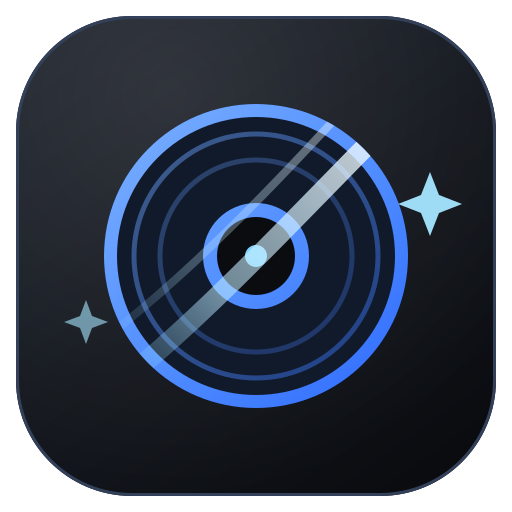

<div align="center">



# BersihDisk

**Disk cleaner for developers** · **Pembersih disk untuk developer**

Frees the gigabytes your toolchain leaves behind: `node_modules`, build artifacts, package caches, AI model caches and temp files — with a modern bilingual UI and a delete step you control.

[](https://github.com/cybersafetyid/BersihDisk/releases)
[](https://github.com/cybersafetyid/BersihDisk/releases)
[](https://github.com/cybersafetyid/BersihDisk/commits/main)
[](https://github.com/cybersafetyid/BersihDisk/issues)
[](https://github.com/cybersafetyid/BersihDisk)
[](https://github.com/cybersafetyid/BersihDisk/forks)

[](#-getting-started)
[](https://go.dev)
[](https://wails.io)
[](https://react.dev)
[](https://www.typescriptlang.org)
[](https://vitejs.dev)

[](LICENSE)
[](#-testing)
[](#-cleanup-categories)
[](#-privacy)
[](README.id.md)
[](CONTRIBUTING.md)
[](CODE_OF_CONDUCT.md)
[](CHANGELOG.md)

**English** · **[Bahasa Indonesia](README.id.md)**

[Download](https://github.com/cybersafetyid/BersihDisk/releases) · [Features](#-features) · [Getting started](#-getting-started) · [Architecture](#-architecture) · [Contributing](CONTRIBUTING.md) · [Changelog](#-changelog--releases) · [Sponsor](#-sponsorship--donations)
</div>

---

## About

BersihDisk is a desktop disk cleaner aimed at developers. A single machine that
builds software accumulates caches fast — a `node_modules` per project, Go and
Cargo module caches, Gradle and Maven repositories, Docker buildx layers,
HuggingFace weights, Xcode DerivedData — and most of it is regenerable.
BersihDisk finds those directories across every mounted drive, shows you what is
inside them, and deletes only what you ticked.

It is a native desktop app (Go + Wails) with a web-tech UI (React + TypeScript),
so scanning is fast and concurrent while the interface stays responsive and
animated. No accounts, no server, no upload.

## ✨ Features

**Detection**
- **Multi-drive scanning** — macOS (`/Volumes`), Windows (A:–Z: via WinAPI), Linux (`/proc/mounts`), each with used/free capacity
- **Two-phase engine** — a *find* phase walking the tree with a system-folder skip-list, then a *measure* phase sizing candidates concurrently, with live progress and cancellation
- **Content-aware matching** — generic `build/`, `target/`, `bin/`, `obj/` folders only count as artifacts when their contents prove it, so source trees are never matched
- **Folder browser** — open any scan result to see its children (sizes computed in parallel, lazily) and pick individual entries; children inside a selected folder are not double-counted

**Cleanup**
- **24 categories** with official brand icons — see [Cleanup categories](#-cleanup-categories)
- **Bulk delete** — multi-select, "select all" / "select ≥ 100 MB" shortcuts, confirmation before anything is removed
- **Two delete modes** — **Trash** (default, restorable, cross-platform via [go-trash](https://github.com/laurent22/go-trash)) or **Permanent** (`os.RemoveAll`, guarded by a red double-confirm modal)
- **Reveal in Finder / Explorer** — from every result row and every folder child

**Interface**
- **Bilingual UI** — English and Bahasa Indonesia, switchable at runtime and persisted
- **Dark / Light / System** themes on neutral matte black, plus a custom accent colour and a runtime app-icon picker
- Motion throughout (stagger fade-in, pop, shimmer, indeterminate progress), skeleton loading, toasts, modal confirmations

**Maintenance**
- **In-app updates** — checks GitHub Releases, shows the changelog, downloads with progress and speed, verifies SHA-256 when GitHub publishes a digest, then hands the file to the OS installer (`.dmg`/`.pkg`/`.zip`, `.exe`/`.msi`)
- **Settings panel** — language, theme, accent, icon, automatic updates, cache clear, feedback email, privacy policy and terms
- **System & app info** — OS, architecture, cores, memory, app size and data folder, in-app

## 🧹 Cleanup categories

24 rules ship today. **Default** = pre-checked when you pick the category;
**opt-in** = unchecked until you ask for it, because deleting it costs a
re-download or is unrecoverable.

| # | Category | Targets | Default |
|---|---|---|---|
| 1 | Node.js | `node_modules` | Default |
| 2 | Go | `~/go/pkg/mod`, download cache, build cache | Default |
| 3 | Rust | `target/` (content-filtered), `~/.cargo/registry` | Default |
| 4 | Gradle | `build/` artifacts (filtered), `~/.gradle/caches` | Default |
| 5 | Maven | `~/.m2/repository`, `target/` (filtered) | Default |
| 6 | C / C++ | `CMakeFiles`, `cmake-build-*` | Default |
| 7 | Python | `__pycache__`, `.pytest_cache`, `.mypy_cache`, `.ruff_cache`, virtualenvs | Default |
| 8 | .NET | `bin/`, `obj/` (Debug/Release/.dll filter) | Default |
| 9 | Frontend build cache | `.next`, `.nuxt`, `.turbo`, `.vite`, `.parcel-cache`, `.svelte-kit`, `.astro`, `coverage`, `storybook-static` | Default |
| 10 | Xcode & iOS | DerivedData, iOS DeviceSupport, CoreSimulator caches, SwiftPM `.build` | Default |
| 11 | Android | `app/build` (multi-segment pattern), `.cxx`, build-cache | Default |
| 12 | Docker & Buildx | `~/.docker/buildx`, Docker Desktop cache and logs | Default |
| 13 | Homebrew | `Library/Caches/Homebrew`, `~/.cache/homebrew` | Default |
| 14 | PHP & Composer | `~/.composer/cache`, `~/.cache/composer` | Default |
| 15 | Python package cache | pip / uv / Poetry wheel caches, `~/.conda/pkgs` | Default |
| 16 | Flutter & Pub | `~/.pub-cache/hosted`, engine cache, `.dart_tool` | Default |
| 17 | Terraform | `.terraform/`, plugin cache | Default |
| 18 | .NET NuGet | `~/.nuget/packages`, HTTP cache | Default |
| 19 | JetBrains | IDE index caches | Default |
| 20 | Electron & browser cache | electron, npm `_cacache`/`_npx`, yarn, pnpm, Playwright, Cypress | **opt-in** |
| 21 | Temp & system cache | `~/.cache`, `%TEMP%`, CrashDumps | **opt-in** |
| 22 | AI / ML cache | HuggingFace, PyTorch, Ollama, Whisper | **opt-in** |
| 23 | Ruby & Gems | `~/.gem`, Bundler cache | **opt-in** |
| 24 | Emulators & simulators | Android AVDs, iOS Simulator data | **opt-in** |

## 🚀 Getting started

### Download

Grab the latest build for your platform from
[Releases](https://github.com/cybersafetyid/BersihDisk/releases). Artifact names
always carry OS and architecture, e.g. `bersihdisk-v1.0.0-macos-arm64.zip`.

macOS: move the app to `/Applications`; the first launch may need a right-click
→ *Open* because the build is unsigned. Windows: run the `.exe` installer or
extract the portable archive. Linux: `chmod +x bersihdisk && ./bersihdisk`.

### Build from source

Prerequisites: **Go 1.23+**, **Node.js 18+**, **Wails CLI v2.12+**.

```bash
git clone https://github.com/cybersafetyid/BersihDisk.git
cd BersihDisk
make doctor          # check the toolchain
make install-deps    # npm install
make dev             # hot-reload development window
```

> **Go ≥ 1.24**: the published `wails` CLI bundles an old `golang.org/x/tools`
> and aborts on Go's new export data (`internal error: package "…" without types
> was imported`). Build a patched CLI once — `make install-wails-fix` installs it
> to `~/.local/bin/wails-fixed`, and the Makefile uses it automatically.

### Package a release build

```bash
make build      # current OS → build/bin/
make build-all  # macOS + Windows + Linux
make release    # check + build + zip into dist/ with release notes
```

## 🛠 Make targets

| Target | Purpose |
|---|---|
| `make run` | build and launch the app |
| `make dev` | development mode with hot reload |
| `make build` | production build for the current OS |
| `make build-all` | cross-compile macOS / Windows / Linux |
| `make test` | Go unit tests (`-race`) + frontend typecheck |
| `make check` | full pre-commit gate: fmt, vet, tests, build |
| `make lint` | vet + typecheck + frontend build |
| `make fmt` / `make vet` / `make tidy` | Go hygiene |
| `make bump VER=1.2.3` | set the version in `VERSION`, `wails.json`, `package.json` |
| `make patch` / `minor` / `major` | semantic version bumps |
| `make release` | build, package `dist/`, then CHANGELOG entry + `v<version>` tag |
| `make release-version VER=1.2.3` | bump and release in one step |
| `make changelog-preview` | print the CHANGELOG entry for the current version |
| `make changelog` | prepend that entry into `CHANGELOG.md` |
| `make tag` | create the annotated git tag `v<version>` on HEAD |
| `make release-notes` | write `dist/bersihdisk-v<version>-notes.md` from the entry |
| `make publish` | create the GitHub release with artifacts + notes |
| `make install-deps` | install frontend dependencies |
| `make doctor` | verify the toolchain (go, node, wails) |
| `make install-wails-fix` | build the Go ≥ 1.24 compatible Wails CLI |
| `make icons` | derive `build/appicon.png` + the in-app icon variants from `assets/logo.*` |
| `make clean` / `distclean` | remove build output / plus `node_modules` |

### Versioning

Nothing is hard-coded. The **`VERSION`** file is the single source of truth: it is
injected into the binary via `-ldflags "-X main.appVersion=$(VERSION)"` (used by
`make dev`, `make build*`, `make release`) and into the bundle metadata
(`CFBundleShortVersionString` / file version) through `{{.Info.ProductVersion}}`
in `build/darwin/Info.plist`. `make bump VER=x.y.z` updates `VERSION`,
`wails.json`, and `frontend/package.json` together.

### Publishing an updatable release

```bash
make release-version VER=1.1.0   # bump + check + build + package + CHANGELOG + tag
make publish                     # gh release create v1.1.0 with notes from CHANGELOG
```

Artifact names must contain the OS (`macos`/`windows`/`linux`) and the
architecture (`arm64`/`x86_64`) so the updater selects the right asset; when
GitHub exposes a `digest`, the download is SHA-256 verified automatically.

## 🏗 Architecture

```
.
├── main.go                 window bootstrap (Wails), ldflags-injected version
├── app.go                  frontend bindings: DetectDrives, StartScan, StartDelete,
│                           ListFolder, Reveal, CheckUpdate, StartUpdateDownload, …
├── VERSION                 single source of truth for the version
├── Makefile                run / build / test / release / bump
├── assets/                 brand logo (SVG source + PNG renders)
├── CHANGELOG.md            release history, newest first
├── scripts/changelog.sh    Conventional Commits -> CHANGELOG entry
├── tools/iconvars/         derives the app-icon variants from assets/logo.png
└── internal/
    ├── rules/              category definitions + matchers (dirNames, homePaths,
    │                       per-OS content filters) — fully unit tested
    ├── drive/              per-platform drive detection (darwin / windows / linux)
    ├── scanner/            two-phase concurrent scan engine + progress events
    ├── deleter/            bulk delete (trash / permanent) + progress + cancel
    ├── browser/            folder listing with recursive sizes
    ├── reveal/             OS handoff: Open (Finder/Explorer), Launch (installer)
    ├── updater/            GitHub Releases check, download with progress, sha256
    ├── appicon/            runtime dock/taskbar icon swap (macOS)
    └── sysinfo/            OS, architecture, cores, memory, host identity
```

```
frontend/src/
├── main.tsx / App.tsx      entry + main flow
├── backend.ts              Wails binding wrapper + event listeners
├── categories/ drives/ scan/ results/ update/   feature panels
├── common/                 Icon (SVG engine), Toast, ThemeSwitch
├── hooks/                  useTheme, useAppliedSettings
├── i18n/                   lookup + interpolation, locales/id.ts, locales/en.ts
├── lib/                    types, format, brandIcons, appIcons, settings, links
└── styles/                 tokens, layout, cards, panels, overlays, utils
```

**Flow:** pick drives and categories → `StartScan` (async goroutine) →
`scan:progress` / `scan:finished` events → results grouped by category → select
items → confirmation modal (trash or permanent) → `StartDelete` →
`delete:progress` / `delete:finished` → summary toast.

## 🔒 Safety

A tool that deletes files has to earn trust, so the design keeps the destructive
path narrow:

- The scanner **never deletes**. Deletion accepts only explicit paths produced by a scan.
- A skip-list protects system locations on every platform: `.Trash`,
  `$Recycle.Bin`, `System Volume Information`, `Windows`, `Program Files`,
  `Library`, `/usr`, `/etc`, and friends.
- Symlinks are never followed — `WalkDir` does not cross mounts or link targets.
- Generic directory names require a content filter before they can match.
- Permanent mode always shows a red warning modal with a second confirmation.
- Risky categories (AI model weights, emulator images, browser caches, temp) are opt-in.

## 🕸 Privacy

BersihDisk runs entirely on your machine: no account, no server, no
developer-side database, no usage telemetry. Scan results live in memory for the
session only. The one network call is the update check — a read request to
`api.github.com` for public release metadata, then the release asset download
from `github.com`; it carries no personal data. Preferences (language, theme,
accent, icon, automatic updates) are stored locally. The full text ships in-app
under **Settings → Privacy policy**.

## 🌐 Languages

The interface ships in **English** and **Bahasa Indonesia**, switchable at
runtime and remembered between launches. Every UI string lives in
`frontend/src/i18n/locales/id.ts` or `en.ts`; both catalogs share one shape and
the `Dictionary` type makes the compiler reject a missing or extra key, so a
half-translated build cannot ship. All code — files, functions, variables,
comments, commits — is in English.

Documentation is split the same way: this file is the English reference, and
[README.id.md](README.id.md) is its full Bahasa Indonesia counterpart.

## 🧪 Testing

```bash
make test        # go test -race ./internal/... + frontend typecheck
go test ./internal/... -v
go vet ./...
```

34 unit tests cover the rules matchers (including the content filters that keep
source directories safe), drive detection, the two-phase scanner, the deleter,
folder browsing, and the updater. The safety-critical path — what may be
matched — is where the test density is highest, and new cleanup categories are
expected to arrive with matcher tests.

## 🩺 Troubleshooting

| Symptom | Fix |
|---|---|
| `wails dev` dies with `internal error: package "…" without types was imported` | Go ≥ 1.24 vs the published CLI: `make install-wails-fix` |
| `make: wails: No such file` | `go install github.com/wailsapp/wails/v2/cmd/wails@v2.12.0`, or use the patched binary |
| macOS blocks the app ("unidentified developer") | right-click the app → *Open*, or `xattr -dr com.apple.quarantine /Applications/BersihDisk.app` |
| Scan misses folders under iCloud / external drives | check drive selection; the walk does not cross mount boundaries or symlinks |
| A directory that should be cleanable is not listed | the content filter rejected it — open an issue with the path and its top-level contents |
| Port 34115 already in use | another `wails dev` instance owns it; quit it or change the dev server port |

## 📑 Changelog & releases

[CHANGELOG.md](CHANGELOG.md) lists every release in
[Keep a Changelog](https://keepachangelog.com/en/1.1.0/) format, newest first,
and the project adheres to [Semantic Versioning](https://semver.org/spec/v2.0.0.html):
**MAJOR** for breaking changes, **MINOR** for new capabilities, **PATCH** for fixes.

Entries are generated from commit subjects rather than written by hand after the
fact, which is why [conventional commits](CONTRIBUTING.md#8-pull-request-workflow)
are required:

| Commit subject | Lands in |
|---|---|
| `feat:` / `feat(scope):` | `### Added` |
| `fix:` | `### Fixed` |
| `perf:` `refactor:` `docs:` `test:` `i18n:` `build:` `ci:` `chore:` `style:` | `### Changed` |
| `remove:` / `deprecate:` / `security:` | `### Removed` / `### Deprecated` / `### Security` |
| anything else | `### Other` |
| `feat!:` / `fix(scope)!:` | marked `**Breaking**` in its section |

Each line keeps its short commit hash, so any entry can be traced back to the
diff. `make publish` uploads the **curated CHANGELOG section** as the release
notes when that version is already listed, and falls back to the freshly generated
commit list otherwise.

Every release is also an **annotated git tag** `vX.Y.Z` — that tag is what
the in-app updater compares against, so a version without a tag is not a release.

```bash
make changelog-preview              # dry run: print the entry for VERSION
make changelog                      # prepend it into CHANGELOG.md
make tag                            # git tag -a v<version>
make release                        # check + build + package, then changelog + tag + notes
make publish                        # GitHub release: artifacts + notes from CHANGELOG
```

`make release` will not invent history: with no commits it warns and skips the
entry and the tag instead of writing an empty one.

## 🤝 Contributing

Bug reports, translations, new cleanup categories, and UI work are all welcome.
Read [CONTRIBUTING.md](CONTRIBUTING.md) for the setup, conventions, the
step-by-step guide to adding a category, and the deletion-safety rules a pull
request is reviewed against. Run `make check` before pushing.

Good starting points: [`good first issue`](https://github.com/cybersafetyid/BersihDisk/issues?q=is%3Aissue+is%3Aopen+label%3A%22good+first+issue%22),
translation gaps, and missing cache paths for tools you actually use.

## 📜 Code of Conduct

Participants are expected to follow the [Code of Conduct](CODE_OF_CONDUCT.md)
(Contributor Covenant 2.1, with an Indonesian summary). Report issues to
**gorbypermana@gmail.com**.

## 🎖 Sponsorship & donations

BersihDisk is free, open source, ad-free, and will stay that way. Donations
unlock nothing — they simply buy the maintainer time.

[](https://github.com/sponsors/cybersafetyid)
[](https://saweria.co/cybersafetyid)
[](https://trakteer.id/cybersafetyid)

Crypto — a wallet address is a long-lived commitment, so these are placeholders
until published officially:

```text
BTC  · REPLACE_WITH_BTC_ADDRESS
ETH / USDT (ERC-20) · REPLACE_WITH_ETH_ADDRESS
USDT (TRC-20) · REPLACE_WITH_TRON_ADDRESS
```

Prefer a pull request over a payment? New cleanup rules, translations, and bug
reports are worth just as much.

## 🙏 Acknowledgements

- [Wails](https://wails.io) — Go + webview desktop framework
- [go-trash](https://github.com/laurent22/go-trash) — cross-platform recycle bin
- [simple-icons](https://github.com/simple-icons/simple-icons) — the official brand SVGs on category cards
- [Lucide](https://lucide.dev) — UI icon set
- [React](https://react.dev), [TypeScript](https://www.typescriptlang.org), [Vite](https://vitejs.dev)

## ⚖️ License

Released under the [MIT License](LICENSE). Copyright © 2026
[Gorby Permana](https://github.com/cybersafetyid). Third-party brand icons
remain under their own trademarks and licenses and are used for identification
only.
